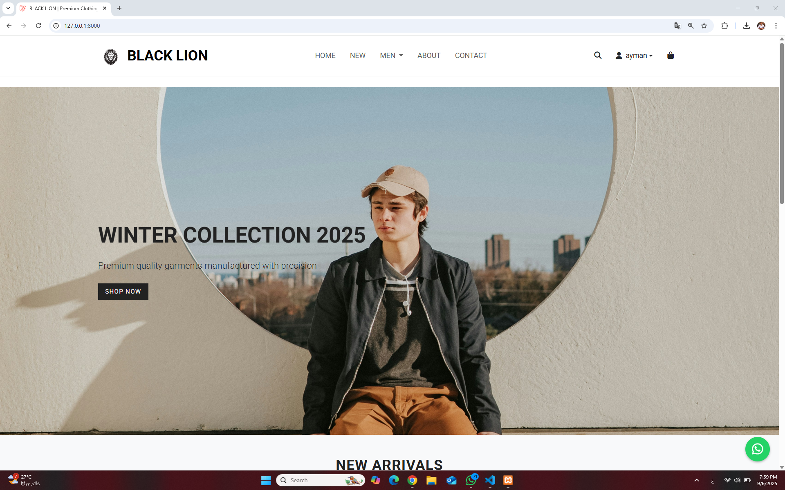
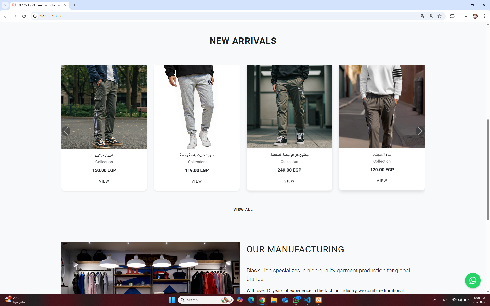

# Black Lion - Laravel Clothing Showroom


## Description
مشروع **Black Lion** هو معرض ملابس لمصنع، تم تطويره باستخدام **Laravel 12** و **Blade Templates**.  
يوفر المشروع واجهة عرض للمنتجات، مع إمكانية إدارة المستخدمين والمنتجات من خلال لوحة الإدارة.

---

## Features

- عرض المنتجات مع الصور والتفاصيل.  
- إدارة المنتجات (إضافة، تعديل، حذف) من لوحة التحكم.  
- تسجيل الدخول والتسجيل للمستخدمين.  
- صلاحيات المستخدمين: مسؤول ومستخدم عادي.  
- صفحة اتصل بنا مع إرسال رسائل البريد الإلكتروني.  
- تصميم متجاوب باستخدام **Bootstrap** ويدعم جميع الشاشات.  

---

## Screenshots
### Home Page


### Products Page



---

## Technologies Used

- **Backend:** Laravel 12  
- **Frontend:** Blade Templates + Bootstrap 5  
- **Database:** MySQL  
- **Others:** Composer, NPM, Tailwind CSS (اختياري)  

---

## Installation

1. Clone the repository:
```bash
git clone https://github.com/AymanEbaid/black-lion-laravel-blade-.git
